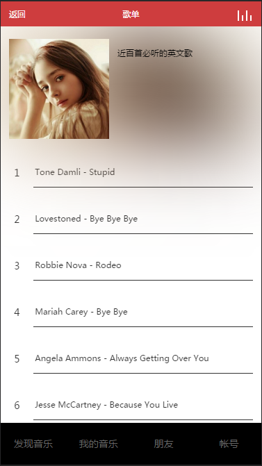

# music


## 扫码体验

[http://cenuon.com:8666](http://cenuon.com:8666)


## 部分截图

 
 


## 干货：项目说明

### 技术栈
react + react-router + redux + webpack + ES6 + fetch + sass + flex

### 项目结构
```
r-music
│  .babelrc
│  .eslintrc.js
│  .gitignore
│  package.json
│  README.md
│  server.js                    //node启动脚本
│  webpack.config.js            
│  
├─config
│      webpack.dev.js           //开发环境的webpack配置文件
│      webpack.hash.js          //开发环境的webpack配置文件
│      webpack.prod.js          //生产环境的webpack配置文件
│           
└─src
    │  api.js                   //封装的fetch
    │  app.js                   
    │  config.js                //api接口配置文件
    │  index.hash.js
    │  index.js
    │  index.temp.hash.html
    │  index.temp.html
    │  routers.js               //路由
    │  storage.js               //window.localStorage的各种方法
    │      
    ├─components               //组件
    │          
    ├─containers               //页面
    │      account.js
    │      album.js
    │      friend.js
    │      home.js
    │      music.js
    │      play.js
    │      
    ├─images
    │      favicon.ico
    │      
    ├─json
    │      home.json
    │       
    ├─actions                 //redux -- action
    │      album.js
    │      dialog.js
    │      home.js
    │      .
    │      .     
    ├─reducers                //redux -- reducer
    │      album.js
    │      dialog.js
    │      home.js
    │      index.js
    │      login.js
    │      message.js
    │      music.js
    │      spin.js
    │      user.js
    │      
    stores                     //redux  -- store
    │      index.js
    │      
    └─sass                    //样式文件
            common.scss
            home.scss
            login.scss
            main.scss
            pagination.scss
            slider.scss
            

```

## 项目运行
```
git clone https://github.com/ScorpionJay/r-music.git
cd r-music
npm install
```
### 本地开发环境
```
npm run dev
```
该命令在package.json的scripts中，即`"dev": "webpack-dev-server --config webpack.config.js --hot"`，启动一个服务。
如果一切正常，会自动打开浏览器并访问`http://localhost:9999`。

```
// config/webpack.dev.js部分代码
        devServer: {
            contentBase: "./src",//本地服务器所加载的页面所在的目录
            historyApiFallback: true,//不跳转
            inline: true,//实时刷新
            host: '0.0.0.0',
            port:9999,
            // 设置代理
            proxy:{
                "/kugou": {
                    target: "http://m.kugou.com",
                    changeOrigin: true,
                    pathRewrite: {"^/kugou" : ""}
                }
            }
        }
```
因为在 `config/webpack.dev.js `设置了host:'0.0.0.0'，所以同局域网的其他手机或PC也可以通过ip+端口号访问。

proxy，设置代理，是为了解决跨域的问题。

### 生产环境
```
npm run build
```
该命令会将所有文件打包，并放在dist目录下。
#### 配置nginx，设置反向代理，解决跨域问题，（数据用的酷狗的）
安装好nginx，找到nginx.conf，并添加如下代码（与默认80端口的server同级，这里只列出了主要的配置项）
```
server {
    #端口号
    listen 8666;
    #项目根目录位置
    root E:/r-music/dist
    #访问首页文件
    location / {
        index index.html
	      try_files $uri  /index.html    // 解决刷新页面404问题
   }
    #缓存静态文件，30d表示30天，可按需调整大小
    location ~ ^/(images|javascript|js|css|flash|media|static)/ {
        expires 30d; 
    }
    #设置代理，解决跨域
    location ^~/kugou/{
      rewrite ^/kugou/(.*)$ /$1 break;
      proxy_pass http://m.kugou.com;
    }
    
    location ^~/ad/{
      rewrite ^/ad/(.*)$ /$1 break;
      proxy_pass http://ads.service.kugou.com;
    }
    
    location ^~/musicSearch/{
      rewrite ^/musicSearch/(.*)$ /$1 break;
      proxy_pass http://mobilecdn.kugou.com;
    }
}
```
重启nginx即可
```
nginx -s reload
```


