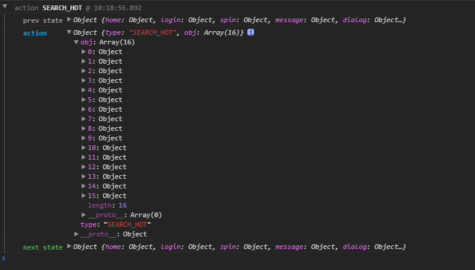

# redux 个人整理
## 序

本人工作之余的闲暇时间还是很充裕的。在完成经理安排的任务后，基本上都是在自学，主要是阅读各种技术文档、浏览博客、运行别人写的一些前端demo并观赏与赞叹。在[ScorpionJay](https://github.com/ScorpionJay) 同学的带领下，我们决定决定做一个react版的音乐播放SPA（Single Page web Application）。

首选，模仿网易云的界面，因为是程序猿最爱的音乐播放器，不解释！然而，分析网易云的数据请求时，貌似全是403。github上有大牛提供了网易云音乐的一些接口，非常好。所以，对于数据接口，我们最后选择了“哈喽，酷狗！”。

阅读了redux的文档后，并参与了一个练手项目[r-music](https://github.com/ScorpionJay/r-music)的部分开发后，通过自己的理解，整理了这篇文档。

初学，所以一定会有不详或者错误的地方。

## 参考文档

开发这个项目，我参阅的学习文档如下：
 
-  React 入门实例教程：[http://www.ruanyifeng.com/blog/2015/03/react](http://www.ruanyifeng.com/blog/2015/03/react)
-  React Router 使用教程：[http://www.ruanyifeng.com/blog/2016/05/react_router.html](http://www.ruanyifeng.com/blog/2016/05/react_router.html)
-  ECMAScript 6 入门：[http://es6.ruanyifeng.com/](http://es6.ruanyifeng.com/)
-  redux中文文档：[http://www.redux.org.cn/](http://www.redux.org.cn/)
-  Redux 入门教程（三）——React-Redux 的用法：[http://www.ruanyifeng.com/blog/2016/09/redux_tutorial_part_three_react-redux.html](http://www.ruanyifeng.com/blog/2016/09/redux_tutorial_part_three_react-redux.html)
-  Flex 布局教程——语法篇：[http://www.ruanyifeng.com/blog/2015/07/flex-grammar.html](http://www.ruanyifeng.com/blog/2015/07/flex-grammar.html)

## 流程图解

通过我自己的理解方式，简单地整理了react、redux、react-redux三者之间的关系图，如下：

## 通过代码，梳理redux、react-redux

注：下面代码只列出搜索功能的关键部分，源码地址：[https://github.com/ScorpionJay/r-music](https://github.com/ScorpionJay/r-music)

### 1. Provider

react-redux提供的`Provider`组件，可以让容器组件取得`state`。

#### src/index.js
	import configureStore from './stores'
	const store = configureStore()

	<Provider store={store}>
		<Router history={browserHistory} routes={routers} />
	</Provider>

上面代码中，`Provider`使得`Router`的所有子组件可以取得`state`。

`import configureStore from './stores'`为redux的store，如下：

#### src/store/index.js
	
	import reducers from '../reducers/index';

	export default function(initialState) {
		let createStoreWithMiddleware
	
		// 判断环境是否logger
		if (process.env.NODE_ENV === 'production') {
			createStoreWithMiddleware = applyMiddleware(thunk)(createStore);
		}else{
			//开发环境在console可以看到整个状态树的实时日志
			const logger = createLogger();
			createStoreWithMiddleware = applyMiddleware(thunk,logger)(createStore);
		}
		let store = createStoreWithMiddleware(reducers, initialState);
		return store;
	};

### 2. react：Component
#### src/containers/search.js
	import React, { Component, PropTypes } from 'react'
	import { connect } from 'react-redux'
	
	import { searchHotAPI,searchResultAPI,clearSearchResultAPI} from '../actions/search'
	
	class Search extends Component {
	
	  constructor(props) {
	    super(props);
	  }
	
	  componentDidMount(){
	    const { dispatch } = this.props
	    dispatch(searchHotAPI())
	  }
	
	  searchEvt(keyword,page=1){
	    const { dispatch } = this.props;
	    keyword = keyword || this.refs.keyword.value
	    if(keyword!=''){
	      dispatch(searchResultAPI(keyword, page));
	    }else{
	      dispatch(clearSearchResultAPI());
	    }
	    this.refs.keyword.value = keyword;
	  }
	
	
	  render() {
	    const { dispatch,controll,search } = this.props;
	    return (
	      

			//...

	      

	    )
	  }
	}
	
	function map(state) {
	  return {
	    search: state.search,
	    controll: state.music.controll
	  }
	}
	
	export default connect(map)(Search)

react-redux的`connect`方法，用于从 UI 组件生成容器组件。

上面代码中，`connect(map)(Search)`使得组件`Search`可以通过`props`取得`map`返回的数据。

`dispatch(searchHotAPI())`和`dispatch(clearSearchResultAPI())`，获取数据并分发action。

### 3. redux

#### src/actions/search.js
	import Config from '../config'
	import { spin,spinHidden } from './spin'
	import api from '../api'
	
	import Storage from '../storage'
	
	//定义常量
	export const SEARCH_HOT = 'SEARCH_HOT'
	export const SEARCH_RESULT = 'SEARCH_RESULT'
	
	//actionCreator,这里是一个函数，返回action对象
	const searchHot = (obj) => {return {type:SEARCH_HOT, obj}}
	const searchResult = (obj) => {return {type:SEARCH_RESULT, obj}}
	
	//搜索热门关键字
	export function searchHotAPI(){
		return async dispatch => {
			try{
				let hots = await api( Config.searchHotAPI );
				dispatch(searchHot(hots.data.info));
			} catch(error) {
				console.log(error);
			}
		}
	}
	
	//通过关键字搜索
	export function searchResultAPI(keyword,page){
		return async dispatch => {
			try {
				let result = await api( Config.searchResultAPI, 'get', {keyword,page} );
				//搜索历史存到localStorage
				setSearchHistory(keyword);
				dispatch(searchResult(result.data.info));
			} catch(error) {
				console.log(error);
			}
		}
	}

上面代码中，`searchHot`和`searchResult`都是Action creator，即分别返回一个action。

action是一个带有type关键字的对象，如`{type:SEARCH_HOT, obj}`和`{type:SEARCH_RESULT, obj}`。

`searchHotAPI`和`searchResultAPI`分别返回一个获取数据并分发action的异步函数，一般在容器组件里会调用。

#### src/reducer/search.js
	import { combineReducers } from 'redux'
	import { SEARCH_HOT,SEARCH_RESULT } from '../actions/search'
	
	function hots(state = [], action){
	  switch(action.type) {
	    case SEARCH_HOT:
	      return action.obj;
	    default:
	      return state;
	  }
	}
	
	function result(state = [], action){
	  switch(action.type) {
	    case SEARCH_RESULT:
	      return action.obj;
	    default:
	      return state;
	  }
	}
	
	
	const Reducers = combineReducers({
	  hots,result,
	})
	
	export default Reducers

上面代码中，`hots`函数收到名为`SEARCH_HOT`的 Action 以后，就返回一个新的 State，作为热门搜索的结果。

在`src/store/index.js`中，开发环境下，引入了中间件`redux-logger`的`createLogger`，在浏览器console可以观察到每次reducer的结果，如下：

#### src/reducer/index.js
	import { combineReducers } from 'redux'
	//...
	import  search from './search'
	
	const reducers = combineReducers({
	  //...
	  search,
	})
	
	export default reducers

Reducer 是一个函数，它接受 Action 和当前 State 作为参数，返回一个新的 State，然后View发生变化。
`combineReducers`将多个拆分的reducer合并。
